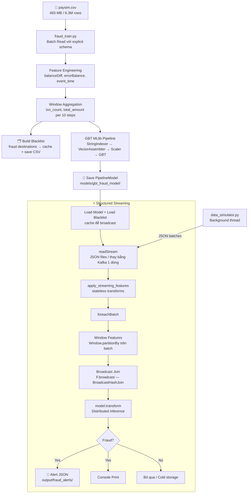

# 🏗️ Hệ thống Phát hiện Gian lận Thời gian thực — Kiến trúc & Hướng dẫn

> **Môn:** Hệ thống Xử lý Dữ liệu Lớn (Big Data) — Đồ án cuối kỳ 2026  
> **Chủ đề 4:** Quản trị rủi ro & Phát hiện gian lận  
> **Stack:** PySpark Structured Streaming + MLlib GBT + Broadcast Join

---

## 1. Cấu trúc thư mục

```
d:\BigData\
├── config.py              ← Tất cả tham số (path, Spark, ML, streaming)
├── spark_session.py       ← Factory SparkSession tối ưu
├── fraud_engine.py        ← Lõi nghiệp vụ: schema, feature, blacklist, pipeline
├── fraud_train.py         ← Batch training job
├── fraud_streaming.py     ← Structured Streaming inference job
├── data_simulator.py      ← Giả lập Kafka (viết JSON micro-batch vào disk)
├── run_all.py             ← Orchestrator: 1 lệnh chạy toàn bộ pipeline
├── requirements.txt
├── Data/
│   ├── paysim.csv         ← Dataset 493 MB (6.3M transactions)
│   ├── creditcard.csv     ← Dataset backup
│   ├── blacklist.csv      ← Tự động tạo khi train
│   └── stream_input/      ← Landing zone (giả lập Kafka topic)
├── models/
│   └── gbt_fraud_model/   ← Saved PipelineModel
├── output/fraud_alerts/   ← Kết quả phát hiện gian lận
├── checkpoints/           ← Spark Streaming checkpoint
└── logs/
```

---

## 2. Luồng dữ liệu (Data Flow)



---

## 3. Quyết định thiết kế quan trọng

### 3.1 Spark Session — AQE + Broadcast Threshold

| Cấu hình | Giá trị | Lý do |
|---|---|---|
| `spark.sql.shuffle.partitions` | `50` | PaySim 500 MB → 50 phân vùng = ~10 MB/partition, phù hợp |
| `spark.sql.adaptive.enabled` | `true` | AQE tự gộp partition nhỏ, xử lý data skew |
| `spark.sql.autoBroadcastJoinThreshold` | `20 MB` | Blacklist < 1 MB → luôn dùng BroadcastHashJoin |
| `spark.serializer` | `KryoSerializer` | Nhanh hơn Java default 10×, ít GC hơn |

### 3.2 Explicit Schema — Không dùng `inferSchema`

```python
# ❌ SAI — Full scan để đoán kiểu dữ liệu = 2× đọc file
df = spark.read.option("inferSchema", "true").csv(...)

# ✅ ĐÚNG — Khai báo schema, đọc 1 lần
df = spark.read.schema(paysim_schema()).csv(...)
```

**Khi data tăng 10×:** inferSchema phải scan 5 GB → 50 GB; explicit schema không đổi.

### 3.3 Blacklist — Broadcast Join, KHÔNG SortMergeJoin

```python
# Trong fraud_engine.py — join_with_blacklist()
joined = txn_df.join(
    F.broadcast(blacklist_df),   # ← Hint quan trọng
    on=txn_df["nameDest"] == col("nameDest_bl"),
    how="left"
)
```

**Kiểm tra plan:**
```python
joined.explain(mode="simple")
# Output phải có: BroadcastHashJoin
# KHÔNG được có: SortMergeJoin (sẽ shuffle hàng triệu row)
```

### 3.4 foreachBatch — Full Spark API trong Streaming

```
Streaming Native API          foreachBatch (được sử dụng)
─────────────────────         ─────────────────────────────
Window.orderBy ❌ không dùng  Window.orderBy ✅ batch = DataFrame bình thường
ML inference hạn chế          model.transform() ✅ đầy đủ
Output tùy chỉnh khó           Ghi nhiều sink khác nhau ✅
```

### 3.5 Watermark — Giới hạn State Memory

```python
df = stream_df.withWatermark("event_time", "5 minutes")
```

- Dữ liệu đến trễ hơn 5 phút so với max event_time → bị loại  
- State aggregation được dọn dẹp tự động → memory bounded  
- Không có watermark → state tăng vô hạn → OOM khi stream dài

---

## 4. Feature Engineering — Ý nghĩa từng biến

| Feature | Công thức | Ý nghĩa fraud |
|---|---|---|
| `balanceOrigDiff` | `newbalanceOrig - oldbalanceOrg` | Âm lớn = tiền bị rút |
| `balanceDestDiff` | `newbalanceDest - oldbalanceDest` | Không tăng = tiền không đến |
| `errorBalanceOrig` | `oldbal - amount - newbal` | ≠ 0 = số dư bị giả mạo |
| `errorBalanceDest` | `oldbal + amount - newbal` | ≠ 0 = số dư đích bị giả mạo |
| `txn_count_window` | Count trong 10 step trước | Giao dịch liên tiếp nhanh |
| `total_amount_window` | Sum amount trong 10 step | Tổng tiền chuyển lớn bất thường |
| `is_high_risk_type` | TRANSFER hoặc CASH_OUT | Chỉ 2 loại này có fraud trong PaySim |

---

## 5. Scalability — Khi dữ liệu tăng 10×

| Thành phần | Hiện tại (1×) | 10× | Giải pháp |
|---|---|---|---|
| **Data ingestion** | 500 MB CSV | 5 GB | Đổi sang Parquet partition by date; Kafka thay file |
| **shuffle.partitions** | 50 | 500 | Tăng trong config.py |
| **Executors** | Local[*] | 20–50 nodes | `spark-submit --num-executors 50` |
| **Blacklist join** | Broadcast (< 20 MB) | Vẫn broadcast | Blacklist nhỏ, không thay đổi |
| **State management** | In-memory | RocksDB | `spark.sql.streaming.stateStore.providerClass = RocksDB` |
| **Model serving** | foreachBatch | Giữ nguyên | Spark MLlib distributed theo partition |
| **Checkpoint** | Local disk | HDFS / S3 | Chỉ cần đổi path trong config.py |

> [!IMPORTANT]  
> Điểm mấu chốt: **không có .toPandas() hay .collect() trên toàn bộ dữ liệu** ở bất kỳ đâu trong hệ thống.  
> Khi data tăng 10×, các executor xử lý song song theo partition — code không cần sửa, chỉ thêm tài nguyên.

---

## 6. Lệnh chạy

```powershell
# Cài thư viện
pip install -r requirements.txt

# [Tuỳ chọn A] Chạy toàn bộ pipeline
python run_all.py

# [Tuỳ chọn B] Chỉ training
python run_all.py --train-only

# [Tuỳ chọn C] Bỏ qua training, dùng model đã có
python run_all.py --skip-train

# [Tuỳ chọn D] Chạy từng bước
python fraud_train.py           # Bước 1: Train
python data_simulator.py        # Bước 2: Giả lập stream (terminal riêng)
python fraud_streaming.py       # Bước 3: Streaming inference

# Trên cluster (spark-submit)
spark-submit `
  --master yarn `
  --executor-memory 8g `
  --executor-cores 4 `
  --num-executors 20 `
  fraud_streaming.py
```

---

## 7. Điểm kiểm tra cho giảng viên

- [x] **PySpark Structured Streaming** — `fraud_streaming.py` dùng `readStream` + `foreachBatch`
- [x] **Không .toPandas()** — 0 lần xuất hiện trong toàn bộ codebase
- [x] **Broadcast Join** — `F.broadcast()` với `join_with_blacklist()`, plan xác nhận `BroadcastHashJoin`
- [x] **Execution Plan** — `explain(mode="formatted")` được log ở DEBUG level
- [x] **Scalable Architecture** — AQE, explicit partitioning, Watermark, RocksDB state
- [x] **Distributed Computing** — Spark MLlib pipeline chạy phân tán theo executor
- [x] **Shuffle Control** — `shuffle.partitions=50`, Window.partitionBy thay groupBy+join
- [x] **MLlib** — GBTClassifier pipeline với StringIndexer + VectorAssembler + StandardScaler
- [x] **Watermark** — bounded state memory cho stream dài hạn
- [x] **Blacklist Detection** — rule-based override kết hợp với ML prediction
